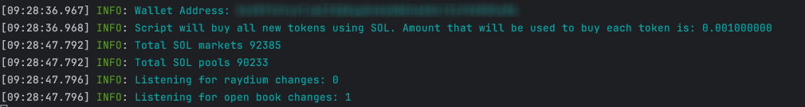

# Solana Sniper Bot

This code is written as proof of concept to demonstrate how we can buy new tokens immediately after the liquidity pool is open for trading.

Script listens to new Raydium USDC or SOL pools and buys tokens for a fixed amount in USDC/SOL. Depending on the speed of the RPC node, the purchase usually happens before the token is available on Raydium UI for swapping.

The bot implements two strategies:

- Buy new tokens and sell them after a specified gain percentage.
- Buy new tokens and sell them after a specified delay.

## Setup

To run the script you need to:

- Create a new empty Solana wallet
- Transfer some SOL to it.
- Convert some SOL to USDC or WSOL.
  - You need USDC or WSOL depending on the configuration set below.
- Configure the script by updating `.env.copy` file (remove the .copy from the file name when done).
  - PRIVATE_KEY (your wallet private key)
  - RPC_ENDPOINT (https RPC endpoint)
  - RPC_WEBSOCKET_ENDPOINT (websocket RPC endpoint)
  - QUOTE_MINT (which pools to snipe, USDC or WSOL)
  - QUOTE_AMOUNT (amount used to buy each new token)
  - COMMITMENT_LEVEL
  - CHECK_IF_MINT_IS_RENOUNCED (script will buy only if mint is renounced)
  - MIN_POOL_SIZE (EXPERIMENTAL) (script will buy only if pool size is greater than specified amount)
  - MAX_POOL_SIZE (script will buy only if pool size is less than specified amount)
  - MAX_SELL_RETRIES (number of retries for selling token)
  - SELL_AFTER_GAIN_PERCENTAGE (sell token after specified gain percentage)
  - SELL_AFTER_GAIN (if we should use strategy to sell after gain)
  - AUTO_SELL (if we should sell token after specified delay)
  - AUTO_SELL_DELAY (delay in milliseconds before selling token)
  - RUGPULL_CHECK (if we should check for rugpull)
- Install dependencies by typing: `npm install`
- Run the script by typing: `npm run buy` in terminal

You should see the following output:  

## Disclaimer

Use this script at your own risk.
